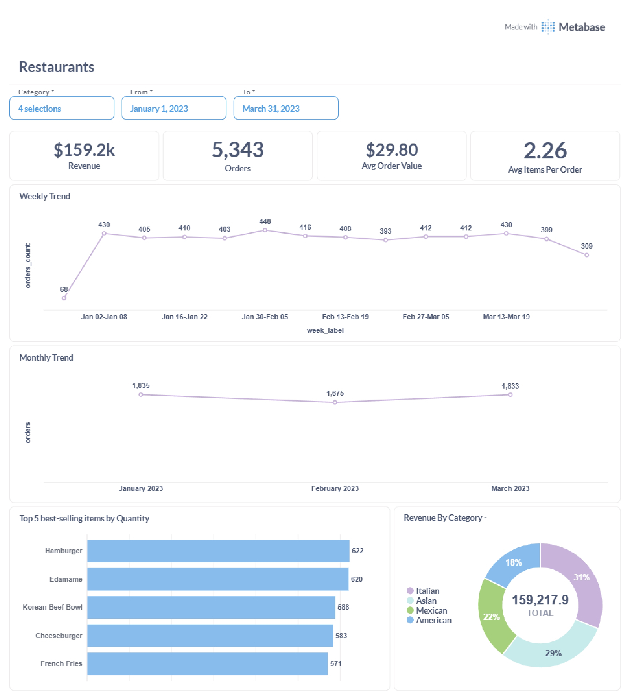
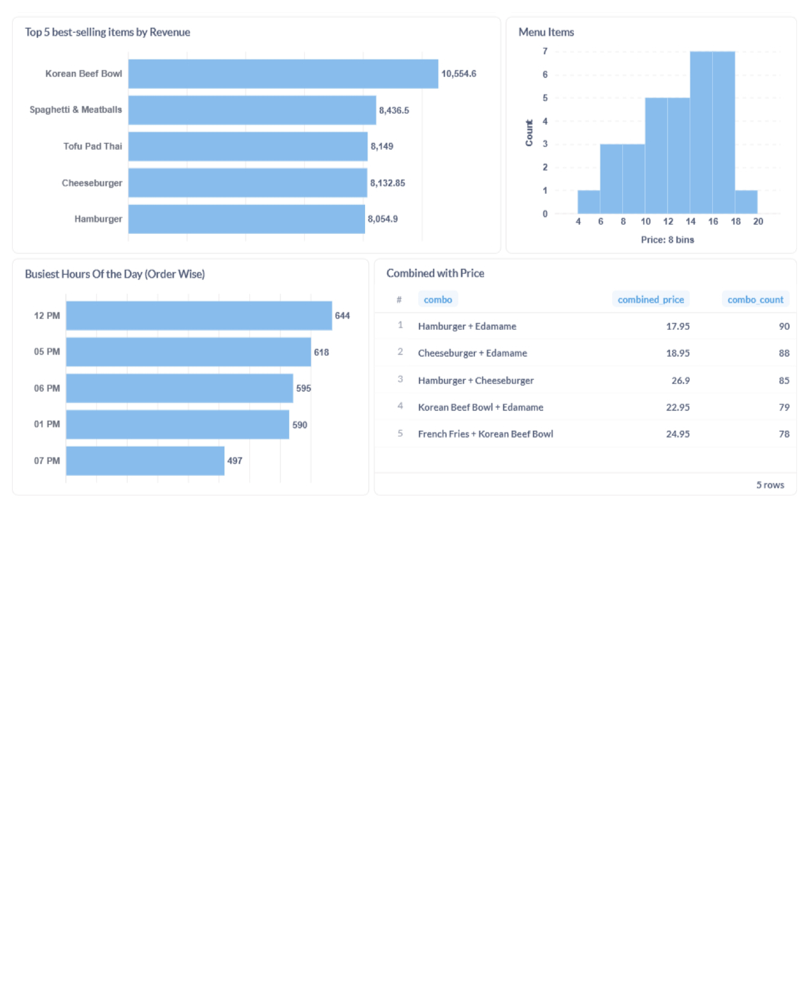
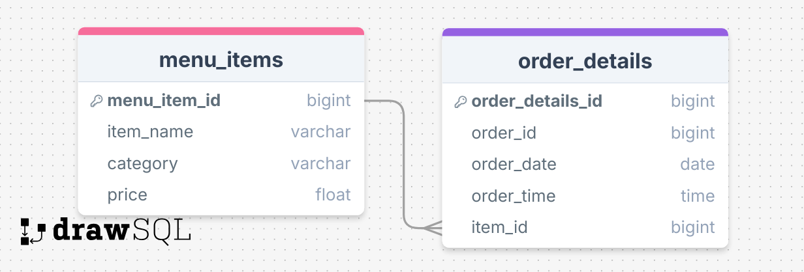

# Restaurant Sales Analytics

This repository contains analysis of restaurant sales data from January 1, 2023 to March 31, 2023. The analysis provides insights into sales trends, popular items, revenue by category, and customer ordering patterns.

## 🔐 Database Credentials

| Field    | Value                                      |
|----------|--------------------------------------------|
| Host     | `aws-0-ap-southeast-1.pooler.supabase.com` |
| Port     | `6543`                                     |
| Database | `postgres`                                 |
| User     | `postgres.ikhkyncvasgdjbkhlgwe`            |
| Password | `sajibkhans_db`                            |

## 📊 Executive Summary

- **Total Revenue**: $159.2k
- **Total Orders**: 5,343
- **Menu Items**: 32
- **Avg. Order Value**: $29.80
- **Avg. Items per Order**: 2.26

## 🔍 Key Insights

### Top-Selling Items by Quantity
- **Hamburger**: 622 units
- **Edamame**: 620 units 
- **Korean Beef Bowl**: 589 units
- **Cheeseburger**: 583 units
- **French Fries**: 571 units

### Top-Selling Items by Revenue
- **Korean Beef Bowl**: $10,554.60
- **Spaghetti & Meatballs**: $8,436.50
- **Tofu Pad Thai**: $8,145.00
- **Cheeseburger**: $8,132.85
- **Hamburger**: $8,054.90

### Revenue by Category
- **Italian**: 31% ($49,357.54)
- **Asian**: 29% ($46,173.19)
- **Mexican**: 23% ($36,620.12)
- **American**: 18% ($28,659.22)

### Peak Ordering Hours
- **12 PM**: 644 orders (lunch rush)
- **5 PM**: 618 orders
- **6 PM**: 595 orders
- **1 PM**: 550 orders
- **7 PM**: 497 orders

## 🍽️ Menu Analysis

### Menu Item Pricing Distribution
- Majority of items priced between $14-$18
- Smaller groups of items priced at $4-$6 and $18-$20

### Popular Item Combinations
| Combo | Combined Price | Orders |
|-------|---------------|--------|
| Hamburger + Edamame | $17.95 | 90 |
| Cheeseburger + Edamame | $18.95 | 88 |
| Hamburger + Cheeseburger | $26.5 | 85 |
| Korean Beef Bowl + Edamame | $22.95 | 79 |
| French Fries + Korean Beef Bowl | $24.95 | 78 |

## 💡 Recommendations

### 1. Promote High-Revenue Items
- Focus marketing campaigns around Korean Beef Bowl, Spaghetti & Meatballs, and Tofu Pad Thai
- Introduce value meals or premium bundles featuring these dishes
- Highlight these items on menu displays and online ordering platforms

### 2. Capitalize on Peak Hours
- Ensure optimal staffing and inventory levels at 12 PM, 5 PM, and 6 PM
- Test limited-time promotions during these peak windows (e.g., "Power Hour Deals")
- Consider express lunch options for the 12 PM rush

### 3. Leverage Popular Combinations
- Feature top combos as official combo meals with a slight discount:
  - "Burger & Edamame Combo" for $17.00 (instead of $17.95)
  - "Double Burger Combo" (Hamburger + Cheeseburger) with a small discount
- Introduce special packages like "Rush Hour Deal" during peak times

### 4. Expand High-Performing Categories
- Italian and Asian cuisine perform best—consider:
  - Adding more variety within these categories
  - Running category-focused promotional campaigns
  - Creating fusion dishes combining elements from top categories

## Screenshots

## Schema

# Author 
- **Shawon Mandal**  
  [LinkedIn](https://www.linkedin.com/in/shawon-mandal-160440260/)

